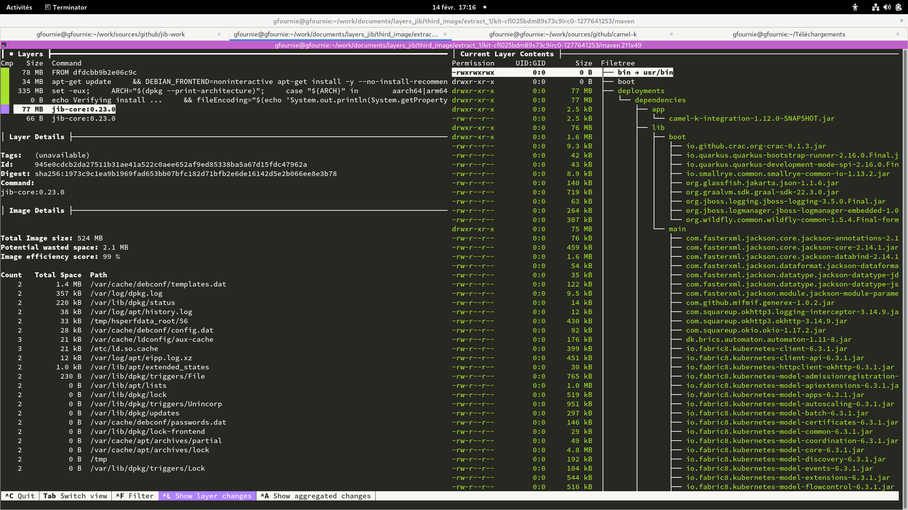
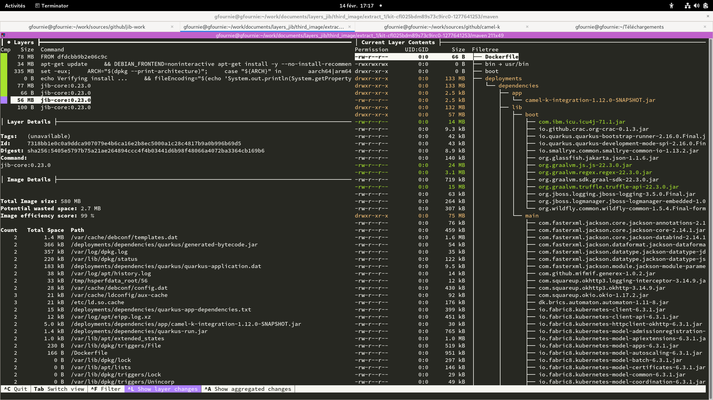
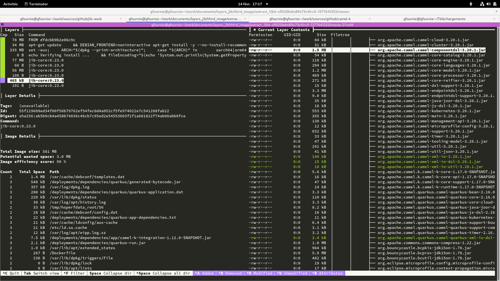

ifdef::env-github[]
:note-caption: ✔️
:warning-caption: ❌
endif::[]
ifdef::env-vscode[]
:note-caption: ✔️
:warning-caption: ❌
endif::[]
=== Fabric8 docker plugin

https://dmp.fabric8.io/

==== Plugin configuration

```xml
      <plugin>
        <groupId>io.fabric8</groupId>
        <artifactId>docker-maven-plugin</artifactId>
        <version>0.41.0</version>
        <configuration>
          <images>
            <image>
              <name>localhost:5000/firstimage/${project.artifactId}:latest</name>
              <build>
                <from>eclipse-temurin:11</from>
                <assembly>
                  <name>deployments</name>
                  <inline>
                    <id>copy-dependencies</id>
                    <formats>
                      <format>dir</format>
                    </formats>
                    <fileSets>
                      <fileSet>
                          <outputDirectory>dependencies</outputDirectory>
                        <directory>${project.basedir}/../context/dependencies</directory>
                      </fileSet>
                    </fileSets>
                  </inline>
                </assembly>
                <cmd>
                  <shell>jshell</shell>
                </cmd>
              </build>
            </image>
          </images>
        </configuration>
      </plugin>
```

By default the plugin use the https://dmp.fabric8.io/#build-assembly-descriptor[default assembly descriptors] to copy the artifacts and dependencies .


The assembly configuration is used to override the default build from the plugin to send all the `context` content as it is in `/deployments/dependencies`.

The maven command used is `docker:build docker:push  -Ddocker.build.jib=true`. An example would be :
```sh
mvn -e docker:build docker:push -Ddocker.build.jib=true -Dmaven.repo.local=/tmp/artifacts/m2 --global-settings /tmp/kit-cfkvvqjdm89s73c9irb0-351212210/maven/settings.xml -Dmaven.artifact.threads=12 -T 12
```

==== Incremental build

[NOTE]
Incremental build is validated

[.float-group]
--
[.left]
.First image


[.left]
.Second image


[.left]
.Third image

--

==== Multi-architecture

[NOTE]
Multi-architecture is validated

The Fabric8 docker maven plugins allow to configures platforms of base images to select from a manifest list.

```xml
          <build>
            ...
            <buildx>
              <platforms>
                <platform>linux/amd64</platform>
                <platform>linux/arm64</platform>
              </platforms>
            </buildx>
          </build>
```
