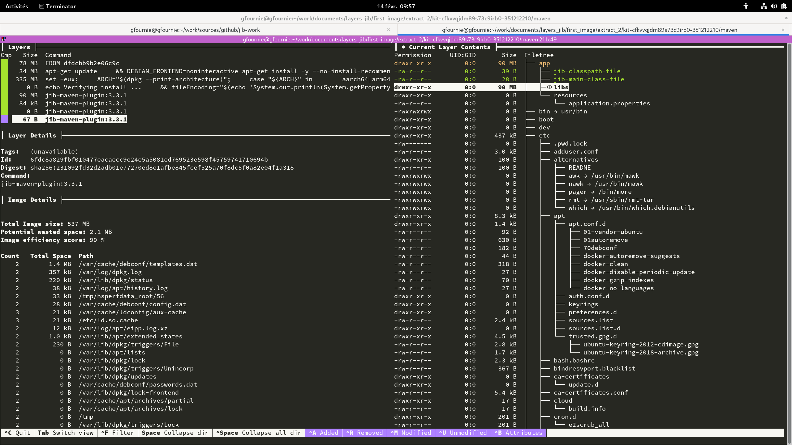
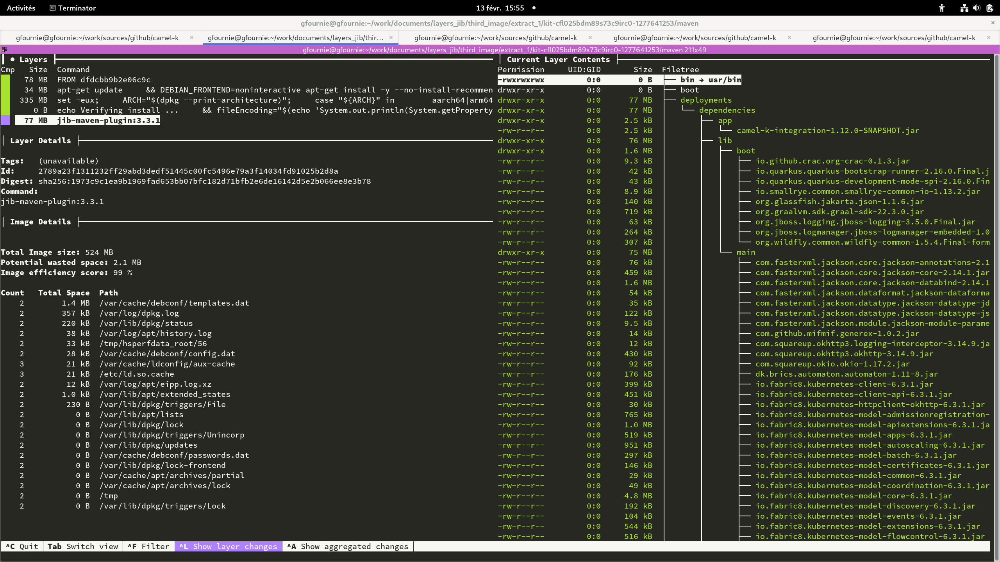
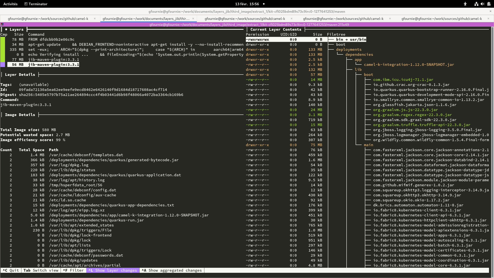
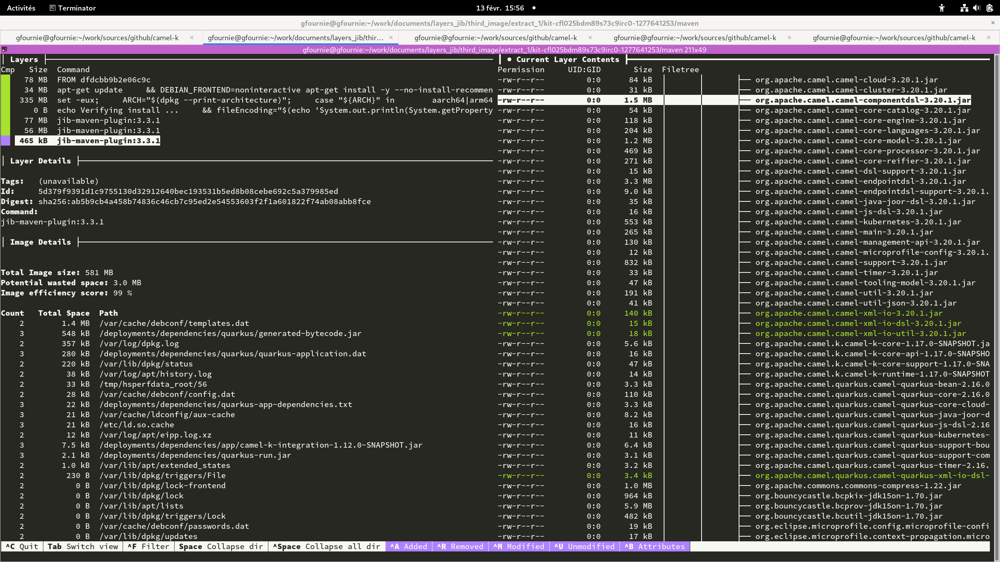

ifdef::env-github[]
:note-caption: :heavy_check_mark:
endif::[]
ifdef::env-vscode[]
:note-caption: ✅
endif::[]
=== Jib maven plugin

https://github.com/GoogleContainerTools/jib/tree/master/jib-maven-plugin

==== Plugin configuration

```xml
      <plugin>
        <groupId>com.google.cloud.tools</groupId>
        <artifactId>jib-maven-plugin</artifactId>
        <version>3.3.1</version>
        <dependencies>
          <dependency>
            <groupId>com.google.cloud.tools</groupId>
            <artifactId>jib-layer-filter-extension-maven</artifactId>
            <version>0.3.0</version>
          </dependency>
        </dependencies>
        <configuration>
          <to>
            <image>localhost:5000/firstimage/${project.artifactId}</image>
            <tags>
              <tag>latest</tag>
            </tags>
          </to>
          <from>
            <image>eclipse-temurin:11</image>
          </from>
          <container>
            <entrypoint>INHERIT</entrypoint>
            <args>
              <arg>jshell</arg>
            </args>
          </container>
          <allowInsecureRegistries>true</allowInsecureRegistries>

          <extraDirectories>
            <paths>
              <path>
                <from>../context</from>
                <into>/deployments</into>
              </path>
            </paths>
          </extraDirectories>
          <pluginExtensions>
            <pluginExtension>
              <implementation>com.google.cloud.tools.jib.maven.extension.layerfilter.JibLayerFilterExtension</implementation>
              <configuration implementation="com.google.cloud.tools.jib.maven.extension.layerfilter.Configuration">
                <filters>
                  <!-- Delete all jar files added automatically by jib. -->
                  <filter>
                    <glob>/app/**</glob>
                  </filter>
                </filters>
              </configuration>
            </pluginExtension>
          </pluginExtensions>
        </configuration>
      </plugin>
```


By default the plugin send all the content to the app folder :

* /app/lib : all the dependencies
* /app/resources : the application.properties file
* /app/jib-classpath-file: runtime classpath that Jib would use for default app launch
* /app/jib-main-class-file: main class

.Default image


To build a valid image, the following are needed:

* the extra directories to send all the `context`` content as it is in `deployments/dependencies`
* the https://github.com/GoogleContainerTools/jib-extensions/tree/master/first-party/jib-layer-filter-extension-maven:[Layer-Filter Extension] to remove the `app` folder


==== Incremental build

[NOTE]
Incremental build is validated


[.float-group]
--
[.left]
.First image


[.left]
.Second image


[.left]
.Third image

--

==== Multi-architecture

[NOTE]
Multi-architecture is validated

The JIB maven plugins allow to configures platforms of base images to select from a manifest list.

```xml
          <from>
            <image>eclipse-temurin:11</image>
            <platforms>
              <platform>
                <architecture>amd64</architecture>
                <os>linux</os>
              </platform>
              <platform>
                <architecture>arm64</architecture>
                <os>linux</os>
              </platform>
            </platforms>
          </from>
```
