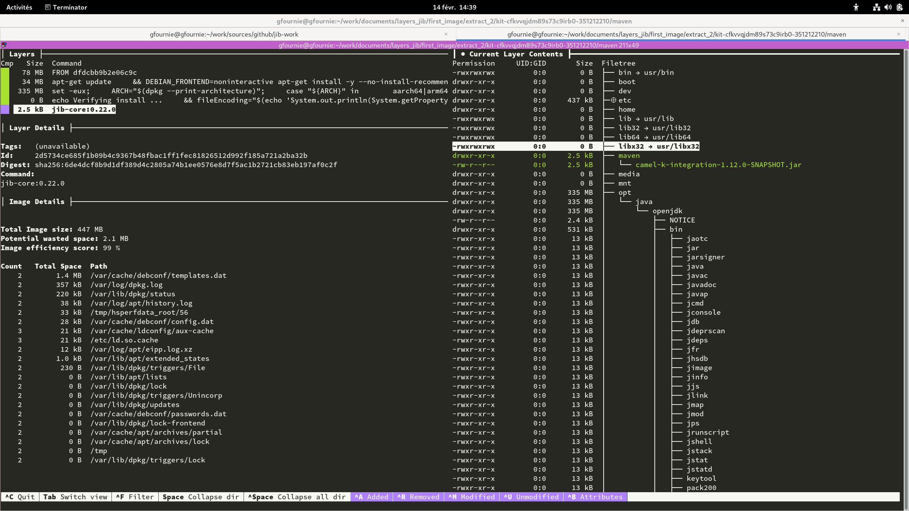
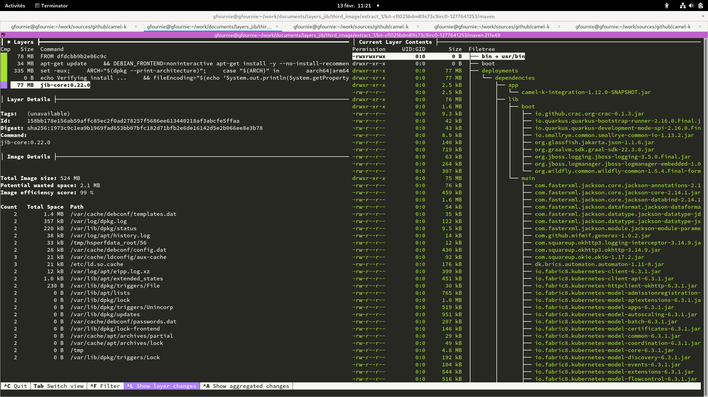
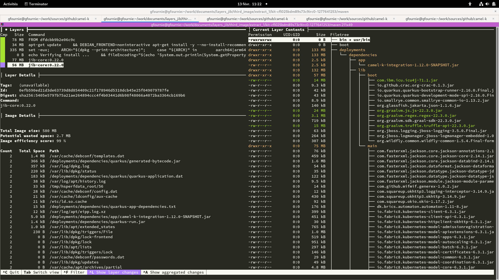
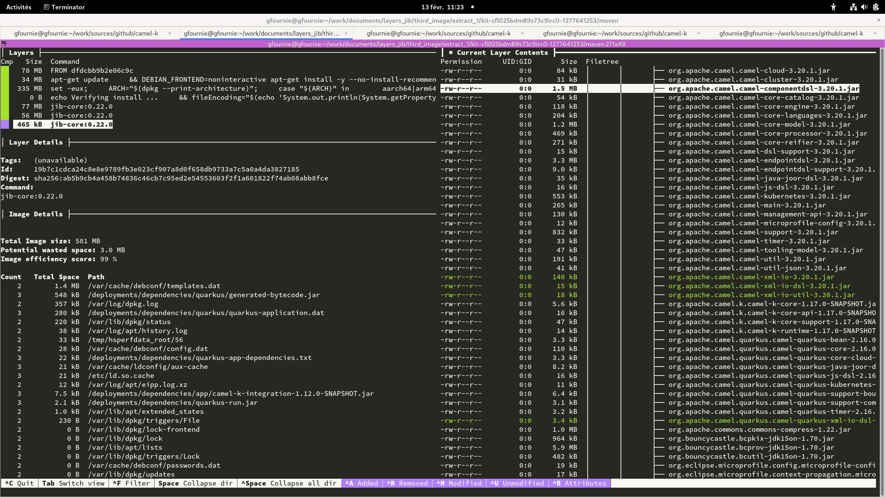

ifdef::env-github[]
:note-caption: ✔️
:warning-caption: ❌
endif::[]
ifdef::env-vscode[]
:note-caption: ✔️
:warning-caption: ❌
endif::[]
=== Jkube Kubernetes Plugin

https://www.eclipse.org/jkube/docs/kubernetes-maven-plugin/


==== Plugin configuration

```xml

      <plugin>
        <groupId>org.eclipse.jkube</groupId>
        <artifactId>kubernetes-maven-plugin</artifactId>
        <version>1.10.1</version>
        <configuration>
          <buildStrategy>jib</buildStrategy>
          <images>
            <image>
              <name>localhost:5000/firstimage/${project.artifactId}:%l</name>
              <build>
                <from>eclipse-temurin:11</from>
                <assembly>
                  <mode>dir</mode>
                  <targetDir>/deployments</targetDir>
                  <layers>
                    <layer>
                      <id>dependencies</id>
                      <fileSets>
                        <fileSet>
                          <directory>${project.basedir}/../context/dependencies</directory>
                          <outputDirectory>dependencies</outputDirectory>
                        </fileSet>
                      </fileSets>
                    </layer>
                  </layers>
                  <excludeFinalOutputArtifact>true</excludeFinalOutputArtifact>
                </assembly>
                <cmd>
                  <shell>jshell</shell>
                </cmd>
              </build>
            </image>
          </images>
        </configuration>
      </plugin>
```

By default the plugin send the packaged application to /maven.

.Default image


The assembly configuration is used to override the default build from the plugin to create the specific layer containing the `context` content as it is in `/deployments/dependencies`.

The maven command used is `k8s:build k8s:push`. An example would be :
```sh
mvn -e k8s:build k8s:push -Dmaven.repo.local=/tmp/artifacts/m2 --global-settings /tmp/kit-cfkvvqjdm89s73c9irb0-351212210/maven/settings.xml -Dmaven.artifact.threads=12 -T 12
```

==== Incremental build

[NOTE]
Incremental build is validated


[.float-group]
--
[.left]
.First image


[.left]
.Second image


[.left]
.Third image

--

==== Multi-architecture

[WARNING]
Multi-architecture is not available

The Jkube Kubernetes maven plugin does not yet provides any way to build images for multiple architectures : https://github.com/eclipse/jkube/issues/1876.
