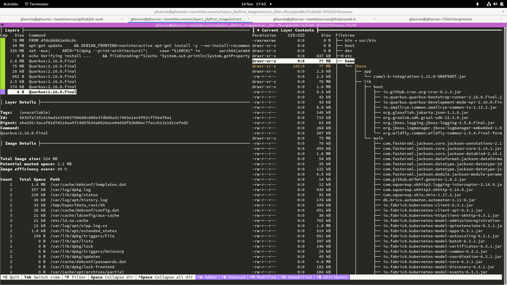
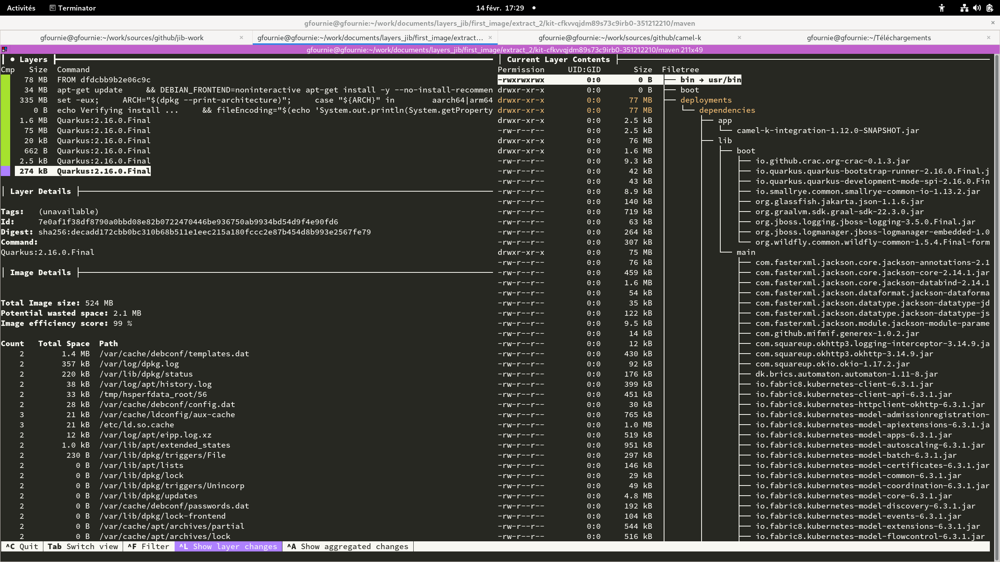
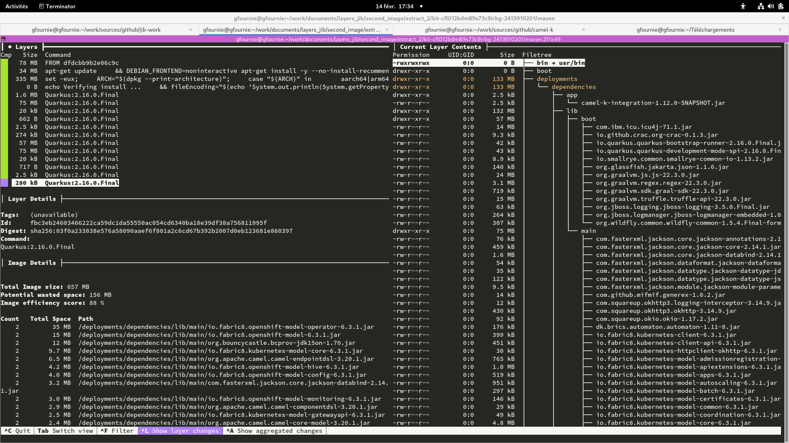
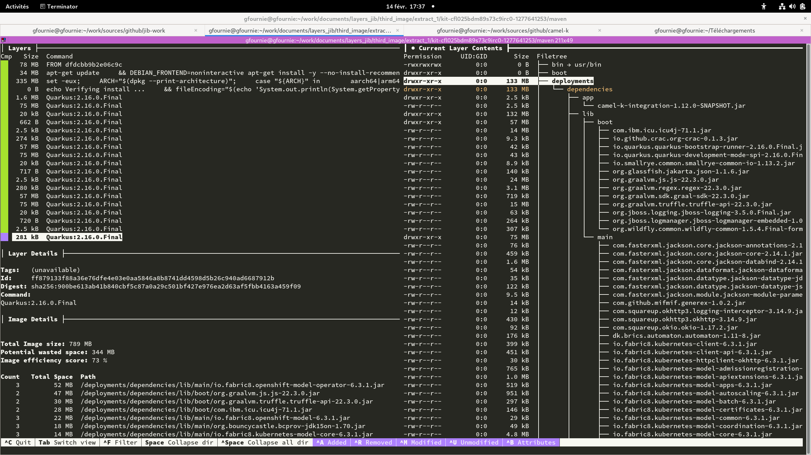

ifdef::env-github[]
:note-caption: ✔️
:warning-caption: ❌
endif::[]
ifdef::env-vscode[]
:note-caption: ✔️
:warning-caption: ❌
endif::[]
=== Quarkus Container Extension Jib

https://quarkus.io/guides/container-image

==== Plugin configuration


```xml
  <dependency>
    <groupId>io.quarkus</groupId>
    <artifactId>quarkus-container-image-jib</artifactId>
  </dependency>
```

By default the plugin send the packaged application to `/home/jboss``.

.Default image


The extension parameters are used to change the target folder to `/deployments/dependencies` but can't allow to use another source than the dependencies defined in the pom.xml.

The maven command used is `k8s:build k8s:push`. An example would be :
```sh
mvn -e install -Dmaven.repo.local=/tmp/artifacts/m2     --global-settings /tmp/kit-cfkvvqjdm89s73c9irb0-351212210/maven/settings.xml  -Dmaven.artifact.threads=12 -T 12 -Dquarkus.container-image.builder=jib -Dquarkus.container-image.push=true -Dquarkus.container-image.registry=localhost:5000 -Dquarkus.container-image.group=firstimage -Dquarkus.container-image.name=camel-k-integration  -Dquarkus.container-image.tag=latest -Dquarkus.container-image.insecure=true  -Dquarkus.jib.working-directory=/deployments/dependencies -Dquarkus.jib.base-jvm-image=eclipse-temurin:11
```


==== Incremental build

[WARNING]
Incremental build is not good enought. Each build add the full target/lib folder content, and it is not possible to change to another folder. This results in a lot of wasted space.


[.float-group]
--
[.left]
.First image


[.left]
.Second image


[.left]
.Third image

--

==== Multi-architecture

[NOTE]
Multi-architecture is validated

The Quarkus Container Extension Jib allows to configures platforms of base images to select from a manifest list by adding this command property `-Dquarkus.jib.platforms="linux/amd64,linux/arm64/v8"`.
